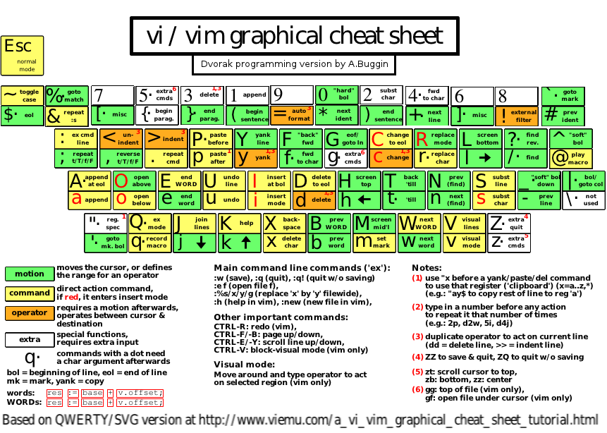

# Vim Setting

## Setup
### iTerm2 + Oh My Zsh
- [iTerm2 + Oh My Zsh + Solarized color scheme + Source Code Pro Powerline + Font Awesome + [Powerlevel10k] - (macOS)](./iterm2-solarized_instructions.md)

#### How to get `Cmd-left/right` working with iTerm2 and Vim?

- iTerm2 Preference -> Keys -> `+` 

| FOR       | ACTION         | SEND    | PURPOSE                     |
|-----------|----------------|---------|-----------------------------|
| Cmd-Left  | "SEND ESC SEQ" | `[1~`   | move to beginning of a line |
| Cmd-Right | "SEND ESC SEQ" | `[4~`   | move to end of a line       |
| Opt-Left  | "SEND ESC SEQ" | `[1;5D` | move to previous word       |
| Opt-Right | "SEND ESC SEQ" | `[1;5C` | move to next word           |

#### open new tab (Cmd+T)  with same profile
- iTerm2 Preferences -> `Profiles` -> `General`
- `working directory` -> `Reuse previous session's directory`

### Install Vim supporting Python 3
- [[MacOS] 安裝支援 Python3 的 VIM 版本](https://clay-atlas.com/blog/2020/10/25/macos-cn-vim-support-python3/): homebrew 安裝 vim3

## Recommended .vimrc configs 
- [PYTHON .VIMRC](https://github.com/ets-labs/python-vimrc)
- [amix/vimrc](https://github.com/amix/vimrc): The Ultimate vimrc
- [ziegfiroyt/react-vimrc](https://github.com/ziegfiroyt/react-vimrc)

## Basic
### Vim CheatSheat 


### Hotkeys: User Config
- `Ctrl + P`: `:GFiles` FZF search files
- `Ctrl + L`: `:Lines` FZF search line
- `Ctrl + A`: `:ggVG` Select All Lines
- `"`: open NerdTree

### Hotkeys: Default
- `Ctrl + F`/`Ctrl + B`: Page Down / Page Up
- `Ctrl + ^ / 6`: return to the explorer window
- `gg`: go to file top
- `:$`: go to file end

## Trace Code
### vim-gutentags
- [Vim自動生成tags插件vim-gutentag使用方法](https://www.twblogs.net/a/5cecc120bd9eee08f5f1ead4)
- [vim-gutentags](https://github.com/ludovicchabant/vim-gutentags)

```
" gutentags搜索工程目錄的標誌，碰到這些文件/目錄名就停止向上一級目錄遞歸 "
let g:gutentags_project_root = ['.root', '.svn', '.git', '.project']

" 所生成的數據文件的名稱 "
let g:gutentags_ctags_tagfile = '.tags'

" 將自動生成的 tags 文件全部放入 ~/.cache/tags 目錄中，避免污染工程目錄 "
let s:vim_tags = expand('~/.cache/tags')
let g:gutentags_cache_dir = s:vim_tags
" 檢測 ~/.cache/tags 不存在就新建 "
if !isdirectory(s:vim_tags)
   silent! call mkdir(s:vim_tags, 'p')
endif

" 配置 ctags 的參數 "
let g:gutentags_ctags_extra_args = ['--fields=+niazS', '--extra=+q']
let g:gutentags_ctags_extra_args += ['--c++-kinds=+pxI']
let g:gutentags_ctags_extra_args += ['--c-kinds=+px']
```


### Learn
- [vim101](https://github.com/bingeboy/vim101)


## Reference
- [VIM Awesome](https://vimawesome.com/)
- [每個開發者都應該要會用的編輯器–Vim](https://medium.com/@jinghua.shih/%E6%AF%8F%E5%80%8B%E9%96%8B%E7%99%BC%E8%80%85%E9%83%BD%E6%87%89%E8%A9%B2%E8%A6%81%E6%9C%83%E7%94%A8%E7%9A%84%E7%B7%A8%E8%BC%AF%E5%99%A8-vim-5f83349973a3)
